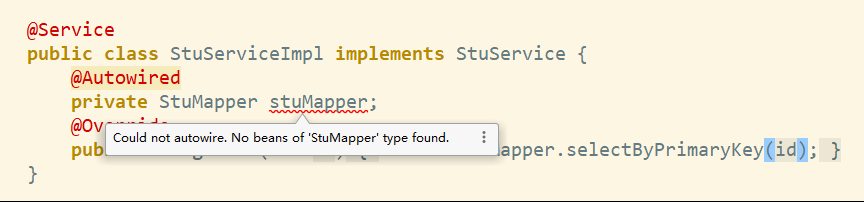
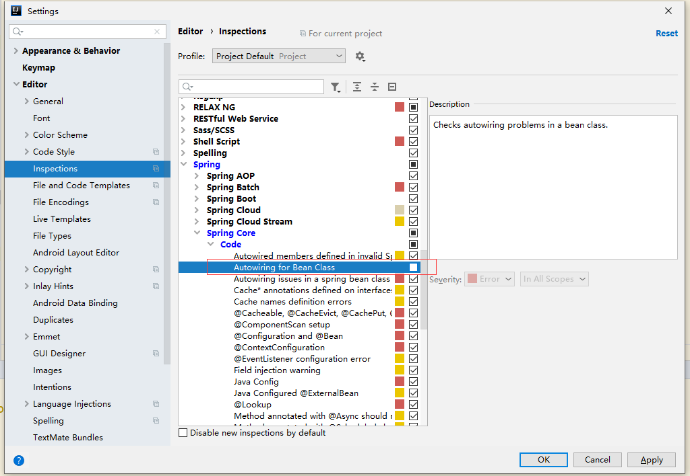

1. [Intellj安装破解](#intellj安装破解)
	1. [安装](#安装)
	2. [破解](#破解)
2. [markdown插件](#markdown插件)
3. [自动注入mapper报错问题设置](#自动注入mapper报错问题设置)
4. [Terminal 配置 git bash 中文乱码](#terminal-配置-git-bash-中文乱码)


# Intellj安装破解

## 安装
[下载地址](https://download.jetbrains.com/idea/ideaIU-2019.2.4.exe)

## 破解

 - [下载破解工具](https://github.com/RunningSow/my-note/raw/master/source/jetbrains-agent-latest.zip)
 - 解压到IDEA安装目录的bin下
 - 修改IDEA配置文件
	 - 打开c盘--用户--（对应用户的名字及计算机名字）--找到   .IntelliJIdea2019.2  文件夹 ，打开config，
	 - 编辑   idea64.exe.vmoptions  最后一行添加   -javaagent:【D:\develop\IntelliJ IDEA 2019.2.4\bin\jetbrains-agent.jar】 括号内是你的破解包内的绝对地址请写自己的
	 - 打开 idea 配置请选择  Activation Code 将破解包中 Activation_Code内的码复制到文本框即可
     

# markdown插件

 - [向md文件插入图片](https://www.jianshu.com/p/499c48f5de22)
 - [更多插件用法](https://blog.csdn.net/qq_41720208/article/details/102647500)


# 自动注入mapper报错问题设置

 - 问题现象：


 - 解决方案:
 

> 设置下IDE选项
File ->Settings ->Editor -> Inspetions ->Spring ->Spring core -> Core ->Autowiring for  Bean Class



# Terminal 配置 git bash 中文乱码

解决方法： git的安装路径下etc文件下有个 bash.bashrc 文件，在这个文件末尾追加：

``` bash
export LANG="zh_CN.UTF-8" 
export LC_ALL="zh_CN.UTF-8" 
```

比如我的git 安装路径就是 :C:\Program Files\Git 我修改的就是：C:\Program Files\Git\etc\bash.bashrc 文件