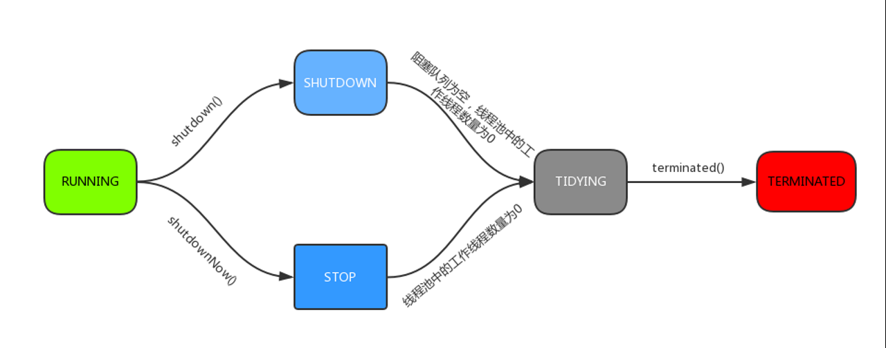
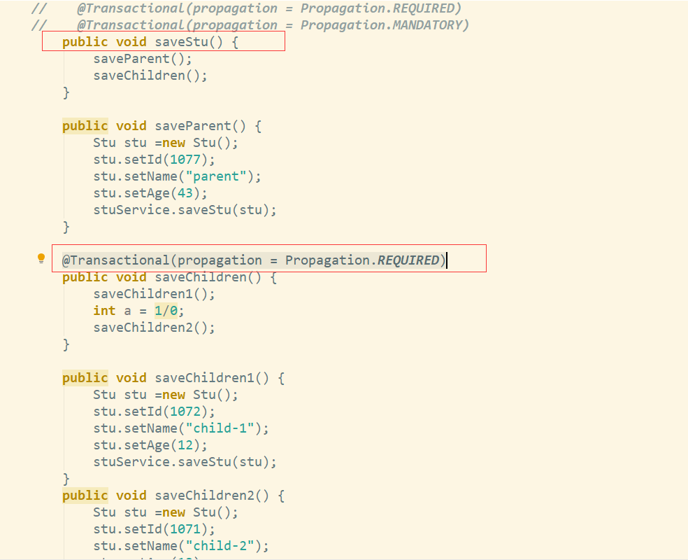

1. [线程池ThreadPoolExecutor](#线程池threadpoolexecutor)
	1. [构造参数说明](#构造参数说明)
	2. [线程池参数设置](#线程池参数设置)
	3. [线程池执行原理](#线程池执行原理)
	4. [线程池状态](#线程池状态)
	5. [JDK提供的实现类](#jdk提供的实现类)
		1. [FixedThreadPool](#fixedthreadpool)
		2. [CachedThreadPool](#cachedthreadpool)
		3. [SingleThreadExecutor](#singlethreadexecutor)
		4. [ScheduledThreadPool](#scheduledthreadpool)
			1. [构造方法](#构造方法)
			2. [应用](#应用)
	6. [线程池的监控](#线程池的监控)
2. [Spring事务](#spring事务)
	1. [什么是事务](#什么是事务)
	2. [事务的特性](#事务的特性)
	3. [事务的并发问题](#事务的并发问题)
	4. [MySQL事务隔离级别](#mysql事务隔离级别)
	5. [	事务的传播机制](#事务的传播机制)
	6. [Spring事务传播行为中可能的坑点](#spring事务传播行为中可能的坑点)
3. [SpringAOP](#springaop)
	1. [名词术语](#名词术语)
	2. [通知(Advice)](#通知advice)
	3. [切点(PointCut)](#切点pointcut)
		1. [定义切点](#定义切点)
	4. [使用AOP记录日志](#使用aop记录日志)

# 线程池ThreadPoolExecutor
## 构造参数说明

``` java
public ThreadPoolExecutor(int corePoolSize, // 1
                        int maximumPoolSize,  // 2
                        long keepAliveTime,  // 3
                        TimeUnit unit,  // 4
                        BlockingQueue<Runnable> workQueue, // 5
                        ThreadFactory threadFactory,  // 6
                        RejectedExecutionHandler handler ) { //7
```

 - **corePoolSize** ：核心线程数量，默认不会被回收，会一直存在于线程池中,设置allowCoreThreadTimeout=true（默认false）时，核心线程会超时关闭
 - **maximumPoolSize** ：线程池中最大线程数，包含核心线程数
 - **keepAliveTime** ： 非核心线程空闲超时时间
 - **unit** ：keepAliveTime的单位
 - **workQueue** : 阻塞队列，它一般分为
	- 直接提交队列(SynchronousQueue)
	- 有界任务队列（ArrayBlockingQueue）
	- 无界任务队列(LinkedBlockingQueue)
	- 优先任务队列（PriorityBlockingQueue）
 - **threadFactory** ：线程工厂，用于创建线程，可以自定义，重命名线程名称，一般用默认即可
 - **handler**: 拒绝策略；当任务太多来不及处理时，如何拒绝任务；
	- 	new ThreadPoolExecutor.AbortPolicy();  将抛出 RejectedExecutionException.
	- 	new ThreadPoolExecutor.CallerRunsPolicy(); 任务将由调用者线程去执行
	- 	new ThreadPoolExecutor.DiscardOldestPolicy();  丢弃任务队列中最旧任务
	- 	new ThreadPoolExecutor.DiscardPolicy(); 丢弃当前任务
## 线程池参数设置
 - 任务类型
	 - IO密集型=2Ncpu（可以测试后自己控制大小，2Ncpu一般没问题）（常出现于线程中：数据库数据交互、文件上传下载、网络数据传输等等）
	 - 计算密集型=Ncpu（常出现于线程中：复杂算法）
	 - 	java中：```Ncpu=Runtime.getRuntime().availableProcessors()```
 - 推算线程池参数：
	 - 	**maximumPoolSize** :设置为2Ncpu或Ncpu，根据任务类型属于IO密集型还是计算密集型
	 - 	**corePoolSize** 设置为 maximumPoolSize 
	 - 	**workQueue** 队列长度：L = timeout * ( corePoolSize / t )		 
	> 队列长度L，线程个数corePoolSize ,每个任务执行耗时t 秒, 每秒可以处理 corePoolSize  / t
	> 个任务，队列最后一个任务处理完总耗时timeout= L / (corePoolSize  / t) =>也是任务的最大超时时间

## 线程池执行原理

> 问题： corePoolSize 是 5 ， maximumPoolSize  是 10，workQueue  队列长度是10，现同时提交30个任务，线程池是如何工作的。
>
> 答：先创建5个核心线程来执行5个任务，然后再将10个任务存到workQueue  队列中，再创建5个非核心线程来执行5个任务，剩下的10个任务会使用拒绝策略处理

## 线程池状态


| 状态       | 解释                                                               |
| ---------- | ------------------------------------------------------------------ |
| RUNNING    | 运行态，可处理新任务并执行队列中的任务                             |
| SHUTDOWN   | 关闭态，不接受新任务，但继续处理队列中的任务                       |
| STOP       | 停止态，不接受新任务，不处理队列中任务，且打断运行中任务           |
| TIDYING    | 整理态，所有任务已经结束，workerCount = 0 ，将执行terminated()方法 |
| TERMINATED | 结束态，terminated() 方法已完成                                 |



## JDK提供的实现类
### FixedThreadPool

``` java
public static ExecutorService newFixedThreadPool(int nThreads) {
        return new ThreadPoolExecutor(nThreads, nThreads,
                                        0L, TimeUnit.MILLISECONDS,
                                        new LinkedBlockingQueue<Runnable>());
}
```

 - corePoolSize与maximumPoolSize相等，即其线程全为核心线程，是一个固定大小的线程池，是其优势
 - keepAliveTime = 0 该参数默认对核心线程无效，而FixedThreadPool全部为核心线程
 - 	workQueue 为LinkedBlockingQueue（无界阻塞队列），队列最大值为Integer.MAX_VALUE。如果任务提交速度持续大余任务处理速度，会造成队列大量阻塞。因为队列很大，很有可能在拒绝策略前，内存溢出。是其劣势；

### CachedThreadPool

``` java
public static ExecutorService newCachedThreadPool() {
        return new ThreadPoolExecutor(0, Integer.MAX_VALUE,
                                        60L, TimeUnit.SECONDS,
                                        new SynchronousQueue<Runnable>());
}
```

 -	 corePoolSize = 0，maximumPoolSize = Integer.MAX_VALUE，即线程数量几乎无限制；
 -	  keepAliveTime = 60s，线程空闲60s后自动结束。
 -	  workQueue 为 SynchronousQueue 同步队列，这个队列类似于一个接力棒，入队出队必须同时传递，因为CachedThreadPool线程创建无限制，不会有队列等待，所以使用SynchronousQueue；

### SingleThreadExecutor

``` java
public static ExecutorService newSingleThreadExecutor() {
        return new FinalizableDelegatedExecutorService
                        (new ThreadPoolExecutor(1, 1,
                                0L, TimeUnit.MILLISECONDS,
                                new LinkedBlockingQueue<Runnable>()));
}
```

 - 	单线程，同FixedThreadPool类似
 
### ScheduledThreadPool
#### 构造方法
``` java
public static ScheduledExecutorService newScheduledThreadPool(int corePoolSize) {
        return new ScheduledThreadPoolExecutor(corePoolSize);
}
		
public ScheduledThreadPoolExecutor(int corePoolSize) {
        super(corePoolSize, Integer.MAX_VALUE, 0, NANOSECONDS, new DelayedWorkQueue());
}

```
#### 应用

``` java
public class ScheduledTest {
    public static void main(String[] args) throws IOException {
        final ScheduledExecutorService scheduledThreadPool = Executors.newScheduledThreadPool(3);
        Runnable runnable = new Runnable() {
            @Override
            public void run() {
                System.out.println("Thread"+ "This task is delayed to execute");
            }
        };
        scheduledThreadPool.scheduleAtFixedRate(runnable,0,1,TimeUnit.SECONDS);
        System.in.read();
    }
}
```

 - 	scheduleAtFixedRate ： 是以上一个任务开始的时间计时，period时间过去后，检测上一个任务是否执行完毕，如果上一个任务执行完毕，则当前任务立即执行，如果上一个任务没有执行完毕，则需要等上一个任务执行完毕后立即执行。
 - 	scheduleWithFixedDelay，是以上一个任务结束时开始计时，period时间过去后，立即执行。

## 线程池的监控

通过线程池提供的参数进行监控。线程池里有一些属性在监控线程池的时候可以使用

 - getTaskCount：线程池已经执行的和未执行的任务总数；
 - getCompletedTaskCount：线程池已完成的任务数量，该值小于等于taskCount；
 - getLargestPoolSize：线程池曾经创建过的最大线程数量。通过这个数据可以知道线程池是否满过，也就是达到了maximumPoolSize；
 - getPoolSize：线程池当前的线程数量；
 - getActiveCount：当前线程池中正在执行任务的线程数量。

# Spring事务
## 什么是事务

> 就是一组/一系列操作，要么都做，要么都不做，
>
> 比如去超市购物： 
>
> 步骤1：挑选商品
>
>  步骤2：结账付款 
>
>  两步缺一不可

## 事务的特性

 - 	原子性（Atomicity）：事务是一个原子操作，由一系列动作组成。事务的原子性确保动作要么全部完成，要么完全不起作用。
 - 	一致性（Consistency）：一旦事务完成（不管成功还是失败），系统必须确保它所建模的业务处于一致的状态，而不会是部分完成部分失败。在现实中的数据不应该被破坏。
 - 	隔离性（Isolation）：可能有许多事务会同时处理相同的数据，因此每个事务都应该与其他事务隔离开来，防止数据损坏。
 - 	持久性（Durability）：一旦事务完成，无论发生什么系统错误，它的结果都不应该受到影响，这样就能从任何系统崩溃中恢复过来。通常情况下，事务的结果被写到持久化存储器中。

## 事务的并发问题

 - 	脏读：事务A读取了事务B更新的数据，然后B回滚操作，那么A读取到的数据是脏数据
 - 	不可重复读：事务 A 多次读取同一数据，事务 B 在事务A多次读取的过程中，对数据作了更新并提交，导致事务A多次读取同一数据时，结果 不一致。
 - 	幻读：系统管理员A将数据库中所有学生的成绩从具体分数改为ABCDE等级，但是系统管理员B就在这个时候插入了一条具体分数的记录，当系统管理员A改结束后发现还有一条记录没有改过来，就好像发生了幻觉一样，这就叫幻读。

> 小结：不可重复读的和幻读很容易混淆，不可重复读侧重于修改，幻读侧重于新增或删除。解决不可重复读的问题只需锁住满足条件的行，解决幻读需要锁表

## MySQL事务隔离级别

| 事务隔离级别                 | 脏读 | 不可重复读 | 幻读 |
| ---------------------------- | ---- | ---------- | ---- |
| 读未提交（read-uncommitted） | 是   | 是         | 是   |
| 不可重复读（read-committed） | 否   | 是         | 是   |
| 可重复读（repeatable-read）  | 否   | 否         | 是   |
| 串行化（serializable）       | 否   | 否         | 否   |

## 	事务的传播机制

> 传播指的是，方法之间调用时，事务会进行向下传递，就是调用方会将事务传递给被调用方

 - PROPAGATION_REQUIRED

> Spring默认的传播机制，能满足绝大部分业务需求，如果外层方法（调用方）有事务，则当前事务加入到外层事务，一块提交，一块回滚。如果外层方法（调用方）没有事务，新建一个事务执行

 - PROPAGATION_REQUES_NEW

		
> 该事务传播机制是每次都会新开启一个事务，同时把外层外层方法（调用方）事务挂起，当当前事务执行完毕，恢复上层方法（调用方）事务的执行。如果外层方法（调用方）没有事务，执行当前新开启的事务即可

 - PROPAGATION_SUPPORT

> 如果外层方法（调用方）有事务，则加入外层方法（调用方）事务，如果外层方法（调用方）没有事务，则直接使用非事务方式执行。完全依赖外层方法（调用方）的事务

 - PROPAGATION_NOT_SUPPORT
		
> 该传播机制不支持事务，如果外层方法（调用方）存在事务则挂起，执行完当前代码，则恢复外层事务，无论是否异常都不会回滚当前的代码

 -  PROPAGATION_NEVER
		
> 该传播机制不支持外层方法（调用方）事务，即如果外层方法（调用方）有事务就抛出异常

 - PROPAGATION_MANDATORY
		
> 与NEVER相反，如果外层方法（调用方）没有事务，则抛出异常

 - PROPAGATION_NESTED
 
> 该传播机制的特点是可以保存状态保存点，当前事务回滚到某一个点，从而避免所有的嵌套事务都回滚，即各自回滚各自的，如果子事务没有把异常吃掉，基本还是会引起全部回滚的。

## Spring事务传播行为中可能的坑点

 - 默认只会检查回滚```RuntimeException```的异常。
 - ```@Transactional```注解只能作用于```public```的方法上，默认传播行为```Propagation.REQUIRED```
 - **service内部方法之间的调用，不会被spring拦截到，也即不会产生事务**



> Spring 事务的管理控制，主要是通过AOP的动态代理增强来实现的，目标对象本身并没有任何的事务管理能力，都是通过代理对象动态增强功能去实现事务管理。在同一个service中的方法调用，相当于是目标对象本身的this调用，并没有经过代理对象，所以自然的事务配置的嵌套均无效。

# SpringAOP
## 名词术语

 - 连接点（join point）:**是具体被拦截的对象**，Spring只支持拦截方法，所以被拦截的对象往往就是指特定的方法。(通知方法的入参)
 - 切点（point cut）：是满足**指定正则表达式规则的方法**。
 - 通知（advice）:
	 - 前置通知（@Before）
	 - 后置通知（@After）
	 - 环绕通知（@Around）
	 - 事后返回通知（@AfterReturning）
	 - 异常通知（@AfterThrowing）
 - 切面（aspect）：通常是一个类，在里面可以定义切入点和通知。
 - AOP 代理：AOP 框架创建的对象，代理就是目标对象的加强。Spring 中的 AOP 代理可以使 JDK 动态代理，也可以是 CGLIB 代理，前者基于接口，后者基于子类

## 通知(Advice)

 - @Before前置通知：在方法调用之前执行
 - @AfterReturning事后返回通知：在方法正常调用之后执行
 - @Around环绕通知：在方法调用之前和之后，都分别可以执行的通知
 - @AfterThrowing异常通知：如果在方法调用过程中发生异常，则通知
 - @After后置通知：在方法调用之后执行

## 切点(PointCut)

### 定义切点

 - 使用注解 ```@PointCut```

	``` java
	@Pointcut("execution(* com.imooc.service.impl..*.*(..))")
	public void service() {}
	```

 - execution 表达式的介绍

	> execution(<修饰符模式>?<返回类型模式><方法名模式>(<参数模式>)<异常模式>?)
	> 
	> 修饰符模式和异常模式为可选项
	

 - execution 表达式解析
 

| 标识符               | 含义                                 |
| -------------------- | ------------------------------------ |
| execution（）        | 表示返回值的类型，* 代表所有返回类型 |
| 第一个 * 符号        | 表示返回值的类型，* 代表所有返回类型 |
| com.abc.service.impl | 要拦截的方法所在的包名               |
| 包名后面的 ..        | 表示当前包及子包                     |
| 第二个 *             | 表示类名，* 表示所有类               |
| 最后的 .*(..)     | 第一个 .* 表示任何方法名，（..） 代表任何类型参数  |

## 使用AOP记录日志	

 - 引入依赖

	``` xml
	<dependency>
		<groupId>org.springframework.boot</groupId>
		<artifactId>spring-boot-starter-aop</artifactId>
	</dependency>
	```

 - 定义切面类
 
	``` java
	@Aspect
	@Component
	public class ServiceLogAspect {
		private static final Logger LOG = LoggerFactory.getLogger(ServiceLogAspect.class); 
		// TODO 下面会补全切点和通知
	}
	```
- 定义切点

	``` java
	@Pointcut("execution(* com.abc.service.impl..*.*(..))")
	public void service() {}
	```

	``` java
	@Pointcut("execution(* com.abc.controller..*.*(..))")
	public void controller() { }
	```
	- 定义环绕通知
		- 返回值需要是```Object```
		- 入参是```ProceedingJoinPoint```
		- 需要执行```joinPoint.proceed();```，方法才会被调用
    ``` java
     @Around("controller()")  // 相当于@Around("execution(* com.abc.controller..*.*(..))")
     public Object recordTimeLog(ProceedingJoinPoint joinPoint) throws Throwable {
        LOG.info(
            "====开始执行 {}.{}==参数={}=", joinPoint.getTarget().getClass(), joinPoint.getSignature().getName(), joinPoint.getArgs());
        long start = System.currentTimeMillis();
        Object object = joinPoint.proceed(); //执行方法
        long end = System.currentTimeMillis();
        long elapse = end -start;
        LOG.info(
                  "====执行完成 耗时{}ms== {}.{}==参数={}=",elapse, joinPoint.getTarget().getClass(), joinPoint.getSignature().getName(), joinPoint.getArgs());
        return object;
      }
    ```
	- 定义前置通知
		- 没有返回值
		- 入参是```JoinPoint```

	``` java
	@Before("service()")
	 public void doBefore(JoinPoint joinPoint) {
		  LOG.info(
				  "===准备执行 {}.{}==参数={}=", joinPoint.getTarget().getClass(), joinPoint.getSignature().getName(), joinPoint.getArgs());
	  }
	```
	- 函数说明
		- 获取类名: ```joinPoint.getTarget().getClass()```
        - 获取方法名: ```joinPoint.getSignature().getName()```
		- 获取入参:  ```joinPoint.getArgs()```