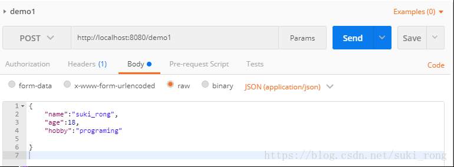
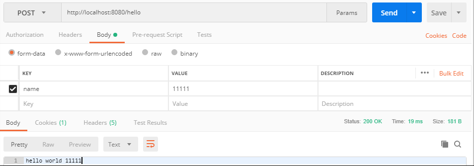
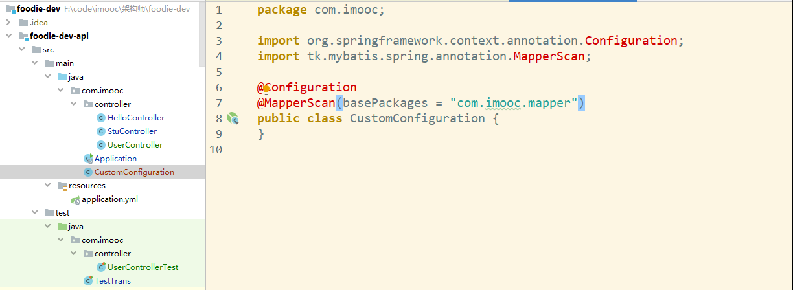
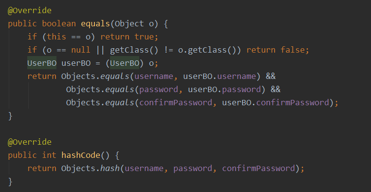
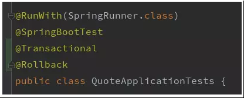

1. [Controller接收参数的几种常用方式](#controller接收参数的几种常用方式)
	1. [请求路径参数](#请求路径参数)
	2. [Body参数](#body参数)
	3. [form表单](#form表单)
2. [整合Hikari+Mysql+Mybatis](#整合hikarimysqlmybatis)
	1. [pom中引入数据源驱动与mybatis依赖](#pom中引入数据源驱动与mybatis依赖)
	2. [在yml中配置数据源和mybatis](#在yml中配置数据源和mybatis)
	3. [在yml中配置tomcat](#在yml中配置tomcat)
	4. [SpringBoot启动时HikariCP不创建连接池问题解决方案](#springboot启动时hikaricp不创建连接池问题解决方案)
3. [单元测试](#单元测试)
	1. [Controller单元测试](#controller单元测试)
		1. [使用注解@WebMvcTes](#使用注解webmvctes)
		2. [注意事项](#注意事项)
			1. [与MayBatis框架整合时的坑](#与maybatis框架整合时的坑)
			2. [使用 对service方法打桩](#使用-对service方法打桩)
	2. [Service单元测试](#service单元测试)
		1. [使用注解@SpringBootTest](#使用注解springboottest)
		2. [注意事项](#注意事项)
4. [SpringBoot基础项目文件配置](#springboot基础项目文件配置)
	1. [引入依赖 parent](#引入依赖-parent)
	2. [设置资源属性](#设置资源属性)
	3. [引入依赖 dependency](#引入依赖-dependency)
	4. [注意事项](#注意事项)
5. [整合Swagger2](#整合swagger2)
	1. [引入依赖](#引入依赖)
	2. [配置文件](#配置文件)
	3. [Swagger-ui访问路径](#swagger-ui访问路径)
	4. [生产环境禁用Swagger](#生产环境禁用swagger)
6. [整合日志log4j](#整合日志log4j)
	1. [移除SpringBoot默认日志](#移除springboot默认日志)
	2. [添加日志框架依赖](#添加日志框架依赖)
	3. [创建log4j.properties并且放到资源文件目录src/main/resources](#创建log4jproperties并且放到资源文件目录srcmainresources)
7. [Springboot获取request和response方式](#springboot获取request和response方式)
	1. [静态方法获取](#静态方法获取)
	2. [方法参数直接获取](#方法参数直接获取)
	3. [自动注入](#自动注入)

# Controller接收参数的几种常用方式

## 请求路径参数

 - @PathVariable
 
    获取路径参数。即url/{id}这种形式。
 
	``` java
	@GetMapping("/demo/{id}")
	public void demo(@PathVariable(name = "id") String id, @RequestParam(name = "name") String name) {
		System.out.println("id="+id);
		System.out.println("name="+name);
	}

	```

 - @RequestParam
 
    获取查询参数。即url?name=这种形式
 
	``` javascript
	GET  http://localhost:8080/demo/123?name=suki_rong
	```

## Body参数

 - @RequestBody
	 - 后端代码

	``` java
	@PostMapping(path = "/demo1")
	public void demo1(@RequestBody Person person) {
		System.out.println(person.toString());
	}
	```

	``` java
	@PostMapping(path = "/demo1")
	public void demo1(@RequestBody Map<String, String> person) {
		System.out.println(person.get("name"));
	}
	```
	- 调用方式

	
	
## form表单

 - 后端代码
 

	``` java
	@PostMapping(value="/hello")
	public String hello(@RequestParam(value="name") String name){
		return "helloworld"+name;
	}
	```

 - 调用方式

    
	
# 整合Hikari+Mysql+Mybatis
 
 ## pom中引入数据源驱动与mybatis依赖
 
 

``` xml
<!-- mysql驱动 -->
<dependency>
	<groupId>mysql</groupId>
	<artifactId>mysql-connector-java</artifactId>
	<version>5.1.41</version>
</dependency>

<!-- mybatis -->
<dependency>
	<groupId>org.mybatis.spring.boot</groupId>
	<artifactId>mybatis-spring-boot-starter</artifactId>
	<version>2.1.0</version>
</dependency>
```

## 在yml中配置数据源和mybatis

``` yml
############################################################
#
# 配置数据源信息
#
############################################################
spring:
  datasource:                                           # 数据源的相关配置
    type: com.zaxxer.hikari.HikariDataSource          # 数据源类型：HikariCP
    driver-class-name: com.mysql.jdbc.Driver          # mysql驱动
    url: jdbc:mysql://localhost:3306/foodie-shop-dev?useUnicode=true&characterEncoding=UTF-8&autoReconnect=true
    username: root
    password: root
    hikari:
      connection-timeout: 30000       # 等待连接池分配连接的最大时长（毫秒），超过这个时长还没可用的连接则发生SQLException， 默认:30秒
      minimum-idle: 5                 # 最小连接数
      maximum-pool-size: 20           # 最大连接数
      auto-commit: true               # 自动提交
      idle-timeout: 600000            # 连接超时的最大时长（毫秒），超时则被释放（retired），默认:10分钟
      pool-name: DateSourceHikariCP     # 连接池名字
      max-lifetime: 1800000           # 连接的生命时长（毫秒），超时而且没被使用则被释放（retired），默认:30分钟 1800000ms
      connection-test-query: SELECT 1

############################################################
#
# mybatis 配置
#
############################################################
mybatis:
  type-aliases-package: com.imooc.pojo          # 所有POJO类所在包路径
  mapper-locations: classpath:mapper/*.xml      # mapper映射文件
  configuration:
    log-impl: org.apache.ibatis.logging.stdout.StdOutImpl # 开启控制台打印sql日志
```

## 在yml中配置tomcat

``` yml
############################################################
#
# web访问端口号  约定：8088
#
############################################################
server:
  port: 8088
  tomcat:
    uri-encoding: UTF-8
  max-http-header-size: 80KB
```

## SpringBoot启动时HikariCP不创建连接池问题解决方案

> 来自 https://blog.csdn.net/qq_31226223/article/details/104008587

通常情况下，我们SpringBoot项目启动完成时，HikariCP都会创建连接池。
我们在控制台的日志中就能直接看到这个信息：

``` stylus
com.zaxxer.hikari.HikariDataSource       : HikariPool-1 - Starting...
com.zaxxer.hikari.HikariDataSource       : HikariPool-1 - Start completed.
```

但是有些项目，在启动时，并没有立即创建连接，而是按需创建连接。这样就会导致，我们数据库配置一旦有错误，我们不能在第一时间发现问题。
查阅一些资料，也有人遇到了相似的问题，通过spring-boot版本降级得到了解决。但我尝试从2.2.X降级到2.1.X并没有解决问题。
经过一些讨论，得到了2个相关的解决方案

issue地址：https://github.com/spring-projects/spring-boot/issues/19596

**HikariCP本身就是按需创建连接，并不会在项目启动时，直接创建。**

如果我们想在程序启动时创建连接，SpringBoot相关人员给出了2个方案。

 - 方案一
 
    我们手动创建一个Bean，启动时我们强制getConnection，来达到启动时创建连接池的目的

	``` java
	@Bean
	public ApplicationRunner runner(DataSource dataSource) {
		return args -> {
			log.info("dataSource: {}", dataSource);
			Connection connection = dataSource.getConnection();
			log.info("connection: {}", connection);
		};
	}
	```
	

 - 方案二
 
    我们手动创建DataSource，而且是根据HikariConfig来创建，这样才可以在初始化DataSource的时候，创建连接池。
 
    ``` java
    @Bean
    public DataSource dataSource() {
        HikariConfig config = new HikariConfig();
        config.setDriverClassName("com.mysql.cj.jdbc.Driver");
        config.setJdbcUrl("jdbc:mysql://xxx.xxx.xxx.xxx:3306/demos?characterEncoding=utf8&useSSL=false&serverTimezone=Asia/Shanghai");
        config.setUsername("root");
        config.setPassword("xxxxxxxxx");
        config.setXxx("xxx");
        config.setYyy("yyy");
        config.setZzz("zzz");
        return new HikariDataSource(config);
    }
    ```
	

 - 方案三
 
    在启动类```main```方法中获取```DataSource```实例并连接

    ``` java
    public static void main(String[] args) throws SQLException {
            ConfigurableApplicationContext context = SpringApplication.run(Application.class, args);
            context.getBean(DataSource.class).getConnection();
    }
    ```


# 单元测试
## Controller单元测试

### 使用注解@WebMvcTes

``` java
package com.lqs.demo.web;

import com.lqs.demo.service.HelloService;
import org.junit.Assert;
import org.junit.jupiter.api.Test;
import org.junit.runner.RunWith;
import org.springframework.beans.factory.annotation.Autowired;
import org.springframework.boot.test.autoconfigure.web.servlet.WebMvcTest;
import org.springframework.boot.test.mock.mockito.MockBean;
import org.springframework.http.HttpStatus;
import org.springframework.mock.web.MockHttpServletResponse;
import org.springframework.test.context.junit4.SpringRunner;
import org.springframework.test.web.servlet.MockMvc;
import org.springframework.test.web.servlet.MvcResult;

import static org.junit.jupiter.api.Assertions.*;
import static org.mockito.Mockito.when;
import static org.springframework.test.web.servlet.request.MockMvcRequestBuilders.post;
import static org.springframework.test.web.servlet.result.MockMvcResultHandlers.print;

@RunWith(SpringRunner.class)
@WebMvcTest(HelloController.class)//使用@WebMvcTest只实例化Web层，而不是整个上下文。在具有多个Controller的应用程序中，
// 甚至可以要求仅使用一个实例化，例如@WebMvcTest(HelloController.class)
class HelloControllerTest {
    @Autowired
    private MockMvc mockMvc;

    @MockBean
    private HelloService helloService; //因为HelloController依赖HelloService ，所以需要使用MockBean注入

    @Test
    void hello() throws Exception {
        //模拟 helloService.getHello("lqs") 方法执行
        when(helloService.getHello("lqs")).thenReturn("Hello world lqs");
        MockHttpServletResponse response = this.mockMvc.perform(post("/hello?name=lqs")).andDo(print()).andReturn().getResponse();
        Assert.assertTrue(response.getStatus() == HttpStatus.OK.value());
        Assert.assertTrue("Hello world lqs".equals(response.getContentAsString()));
    }
}
```
断言的判断也可以使用```andExpect```,```jsonPath```用法看[这里](https://goessner.net/articles/JsonPath/)

``` java
mockMvc .perform(
            post("/users/register")
                .contentType(MediaType.APPLICATION_JSON)
                .content(objectMapper.writeValueAsString(userBO)))
        .andDo(print())
        .andExpect(jsonPath("$.status").value(HttpStatus.OK.value()))
        .andExpect(jsonPath("$.data.username").value(userBO.getUsername()));
```

### 注意事项
#### 与MayBatis框架整合时的坑

 - 不能在启动类上加```@MapperScan``` 注解，否则单元测试执行会报错，将```@MapperScan```移动```CustomConfiguration```类(自定义的)上
	
	
#### 使用```when().thenReturn()``` 对service方法打桩
 - 	当使用```when().thenReturn()``` 打桩时，service方法入参如果是对象，需要该对象重写```equals```和```hashCode```方法，否则```thenReturn()```始终返回```null``` 
	例如：```createUser```方法的入参是个```UserBO```对象
	
	  ``` java
	  when(userService.createUser(userBO)).thenReturn(user);
	  ```
   
 - 需要```UserBO类```重写```equals```和```hashCode``` 
	
	
	
## Service单元测试
 - 来自[简书](https://www.jianshu.com/p/d9d0abf317c0)

### 使用注解@SpringBootTest

``` java
package com.mos.quote;

import com.mos.quote.model.Area;
import com.mos.quote.service.IAreaService;
import org.junit.Assert;
import org.junit.Test;
import org.junit.runner.RunWith;
import org.springframework.beans.factory.annotation.Autowired;
import org.springframework.boot.test.context.SpringBootTest;
import org.springframework.test.annotation.Rollback;
import org.springframework.test.context.junit4.SpringRunner;
import org.springframework.transaction.annotation.Transactional;

import java.util.List;

@RunWith(SpringRunner.class)
@SpringBootTest
public class QuoteApplicationTests {

    @Autowired
    private IAreaService areaService;

    @Test
    public void contextLoads() {
    }

    @Test
    public void testUpdate(){
        Area area = new Area();
        area.setCode("001003");
        area.setName("洛阳市");
        Integer result = areaService.update(area);
        Assert.assertEquals(1, (long)result);
    }

    @Test
    @Transactional
    @Rollback
    public void testUpdate4Rollback(){
        Area area = new Area();
        area.setCode("001001");
        area.setName("郑州市123");
        Integer result = areaService.update(area);
        Assert.assertEquals(1, (long)result);
    }

}

```
### 注意事项

 - 事务回滚，避免产生脏数据
	 - 	```@Transactional```表示该方法整体为一个事务
	 - 	```@Rollback```表示事务执行完回滚，支持传入一个参数value，默认true即回滚，false不回滚。
	 - 	该注解一样支持对类的注解，若如此做，对整个class的方法都有效。



# SpringBoot基础项目文件配置
## 引入依赖 parent

``` xml
<parent>
    <groupId>org.springframework.boot</groupId>
    <artifactId>spring-boot-starter-parent</artifactId>
    <version>2.1.5.RELEASE</version>
    <relativePath />
</parent>
```
## 设置资源属性

``` xml
<properties>
    <project.build.sourceEncoding>UTF-8</project.build.sourceEncoding>
    <project.reporting.outputEncoding>UTF-8</project.reporting.outputEncoding>
    <java.version>1.8</java.version>
</properties>
```
## 引入依赖 dependency

``` xml
<dependencies>
    <dependency>
        <groupId>org.springframework.boot</groupId>
        <artifactId>spring-boot-starter</artifactId>
        <exclusions>
            <exclusion>
                <groupId>org.springframework.boot</groupId>
                <artifactId>spring-boot-starter-logging</artifactId>
                </exclusion>
        </exclusions>
    </dependency>
    <dependency>
        <groupId>org.springframework.boot</groupId>
        <artifactId>spring-boot-starter-web</artifactId>
    </dependency>
    <dependency>
        <groupId>org.springframework.boot</groupId>
        <artifactId>spring-boot-configuration-processor</artifactId>
        <optional>true</optional>
    </dependency>
</dependencies>

```
## 注意事项

 - 主仓的pom文件需要设置packaging为pom
	``` xml
	<packaging>pom</packaging>
	```
 - 使用java -jar命令启动，提示‘没有主清单属性’
 
    在```pom.xml```中加入
 
    ``` xml
    <build>
        <plugins>
            <plugin>
                <groupId>org.springframework.boot</groupId>
                <artifactId>spring-boot-maven-plugin</artifactId>
            </plugin>
        </plugins>
    </build>
	```
# 整合Swagger2
## 引入依赖

``` xml
<!-- swagger2 配置 -->
<dependency>
    <groupId>io.springfox</groupId>
    <artifactId>springfox-swagger2</artifactId>
    <version>2.4.0</version>
</dependency>
<dependency>
    <groupId>io.springfox</groupId>
    <artifactId>springfox-swagger-ui</artifactId>
    <version>2.4.0</version>
</dependency>
<dependency>
    <groupId>com.github.xiaoymin</groupId>
    <artifactId>swagger-bootstrap-ui</artifactId>
    <version>1.6</version>
</dependency>
```
## 配置文件

``` java
package com.abc.config;

import org.springframework.context.annotation.Bean;
import org.springframework.context.annotation.Configuration;
import springfox.documentation.builders.ApiInfoBuilder;
import springfox.documentation.builders.PathSelectors;
import springfox.documentation.builders.RequestHandlerSelectors;
import springfox.documentation.service.ApiInfo;
import springfox.documentation.service.Contact;
import springfox.documentation.spi.DocumentationType;
import springfox.documentation.spring.web.plugins.Docket;
import springfox.documentation.swagger2.annotations.EnableSwagger2;

@Configuration
@EnableSwagger2
@ConditionalOnProperty(value = "swagger2.enable", havingValue = "true")
public class Swagger2 {

//    http://localhost:8088/swagger-ui.html     原路径
//    http://localhost:8088/doc.html     带有样式的路径

    // 配置swagger2核心配置 docket
    @Bean
    public Docket createRestApi() {
        return new Docket(DocumentationType.SWAGGER_2)  // 指定api类型为swagger2
                    .apiInfo(apiInfo())                 // 用于定义api文档汇总信息
                    .select()
                    .apis(RequestHandlerSelectors
                            .basePackage("com.abc.controller"))   // 指定controller包
                    .paths(PathSelectors.any())         // 所有controller
                    .build();
    }

    private ApiInfo apiInfo() {
        return new ApiInfoBuilder()
                .title("电商平台接口api")        // 文档页标题
                .contact(new Contact("abc",
                        "https://www.abc.com",
                        "abc@qq.com"))        // 联系人信息
                .description("专为吃货提供的api文档")  // 详细信息
                .version("1.0.1")   // 文档版本号
                .termsOfServiceUrl("https://www.abc.com") // 网站地址
                .build();
    }

}
```
## Swagger-ui访问路径

 - 原路径 http://localhost:8088/swagger-ui.html 
 - 带有样式的路径 http://localhost:8088/doc.html

## 生产环境禁用Swagger

 - 在类```Swagger2```上加注解 ```@ConditionalOnProperty(value = "swagger2.enable", havingValue = "true")```
	
 - ```application.yml``` 文件新增配置参数
		
	``` yml
	swagger2:
	  enable: true
	```
	
# 整合日志log4j

## 移除SpringBoot默认日志

``` xml
<dependency>
    <groupId>org.springframework.boot</groupId>
    <artifactId>spring-boot-starter</artifactId>
    <exclusions>
        <exclusion>
            <artifactId>spring-boot-starter-logging</artifactId>
            <groupId>org.springframework.boot</groupId>
        </exclusion>
    </exclusions>
</dependency>
```
## 添加日志框架依赖

``` xml
<!--引入日志依赖 抽象层 与 实现层-->
<dependency>
    <groupId>org.slf4j</groupId>
    <artifactId>slf4j-api</artifactId>
    <version>1.7.21</version>
</dependency>
<dependency>
    <groupId>org.slf4j</groupId>
    <artifactId>slf4j-log4j12</artifactId>
    <version>1.7.21</version>
</dependency>
```
## 创建log4j.properties并且放到资源文件目录src/main/resources

``` xml
log4j.rootLogger=DEBUG,stdout,file
log4j.additivity.org.apache=true

log4j.appender.stdout=org.apache.log4j.ConsoleAppender
log4j.appender.stdout.threshold=INFO
log4j.appender.stdout.layout=org.apache.log4j.PatternLayout
log4j.appender.stdout.layout.ConversionPattern=%-5p %c{1}:%L - %m%n

log4j.appender.file=org.apache.log4j.DailyRollingFileAppender
log4j.appender.file.layout=org.apache.log4j.PatternLayout
log4j.appender.file.DatePattern='.'yyyy-MM-dd-HH-mm
log4j.appender.file.layout.ConversionPattern=%d{yyyy-MM-dd HH:mm:ss} %-5p %c{1}:%L - %m%n
log4j.appender.file.Threshold=INFO
log4j.appender.file.append=true
log4j.appender.file.File=/workspaces/logs/foodie-api/mylog.log
```
# Springboot获取request和response方式

> 来自 https://www.jianshu.com/p/b1a9fb969d9a

## 静态方法获取

``` java
@GetMapping(value = "")
public String center() {
    ServletRequestAttributes servletRequestAttributes = (ServletRequestAttributes)RequestContextHolder.getRequestAttributes();
    HttpServletRequest request = servletRequestAttributes.getRequest();
    HttpServletResponse response = servletRequestAttributes.getResponse();
    //...
}

```

## 方法参数直接获取

``` java
@GetMapping(value = "")
public String center(HttpServletRequest request,HttpServletResponse response) {
    //...
}
```

## 自动注入

``` java
@Autowired
private HttpServletRequest request;

@Autowired
private HttpServletResponse response;

@GetMapping(value = "")
public String center() {
    //...
}
```

> Controller层中所注入的HttpServletReuqest的实现类为JDK动态代理生成的一个代理类,不会存在线程安全问题
> 
> 参考：https://blog.csdn.net/zknxx/article/details/77917290
